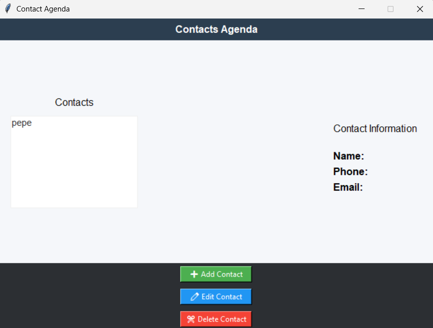
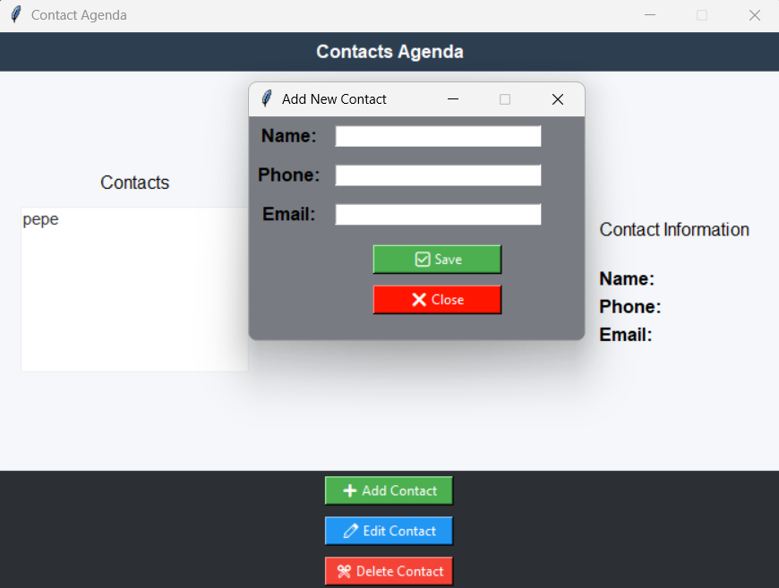
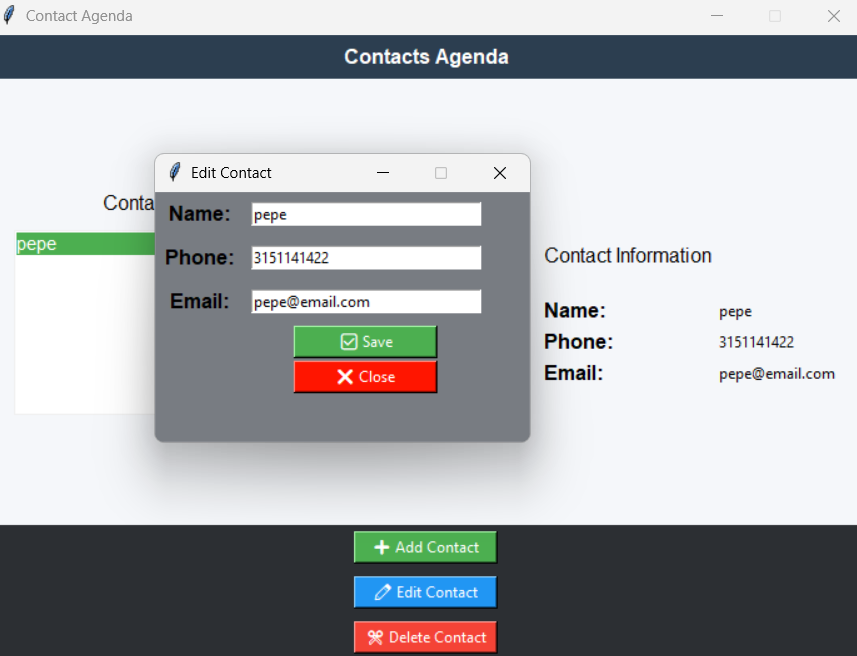
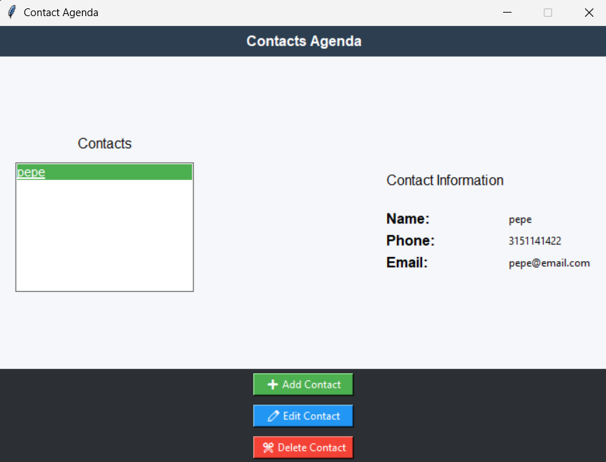

# 📇 Contact Agenda
A desktop application built with Python and Tkinter for managing personal contacts. The application allows users to add, edit, delete, and view contact information. All contacts are stored locally in a JSON file, making the data persistent between sessions.

## ✨ Features
- Add new contacts
- Edit existing contacts
- Delete contacts
- View contact information
- Save contacts to a JSON file
- Automatically load saved contacts
- Validate phone numbers and email addresses

## 📸 Screenshots

### Main Window


### Add Contact


### Edit Contact


### Contact Information


## 🛠️ Technologies
- Python 3
- Tkinter
- JSON

## 📁 Project Structure
```text
Contact-Agenda/
│
├── main.py
├── contacts.json
├── README.md
└── images/
```

## 📋 Requirements
- Python 3.10 or later

## 🚀 How to Run
1. Clone the repository:

```bash
git clone https://github.com/jader-ruiz/Contact-Agenda.git
```

2. Open the project folder.

3. Run:

```bash
python main.py
```

## 🔮 Future Improvements
- Add a search feature
- Sort contacts alphabetically
- Store contacts in an SQLite database
- Export contacts to CSV
- Add profile pictures

## 📚 What I Learned

Through this project, I learned how to:

- Build graphical user interfaces with Tkinter
- Organize a Python project using functions
- Work with JSON files for data persistence
- Validate user input
- Handle events and user interactions

## 💡 Code Highlights

### Loading Contacts
```python
def load_contacts():
    with open("contacts.json") as file:
        contacts = json.load(file)

    for contact in contacts:
        listbox.insert(tk.END, contact["name"])

    return contacts
```
This function loads the contacts from the `contacts.json` file when the application starts. It also adds each contact's name to the Listbox so the user can see them immediately.

### Save Contacts
```python
def save_contacts(): 
    with open("contacts.json", "w") as file: 
        json.dump(contacts, file, indent=4)
```
This function saves all contacts into the `contacts.json` file. Every time the user adds, edits, or deletes a contact, this function is called to keep the information updated.

### Show Contacts
```python
def show_contact(event): 
    index = listbox.curselection()[0] 
    contact = contacts[index] 

    name_value.config(text=contact["name"]) 
    phone_value.config(text=contact["phone"]) 
    email_value.config(text=contact["email"])
```
This function is executed when the user selects a contact in the Listbox. It gets the selected contact and shows the name, phone number, and email on the right side of the window.

### Add contact
```python
def add_contact():
        name = name_entry.get().strip()
        phone = phone_entry.get().strip()
        email = email_entry.get().strip()

        contact = {
        "name": name,
        "phone": phone,
        "email": email
        }
    
        contacts.append(contact)
        listbox.insert(tk.END, name)

        save_contacts()

        name_entry.delete(0, tk.END)
        phone_entry.delete(0, tk.END)
        email_entry.delete(0, tk.END)
```
This function gets the information that the user writes in the Entry fields. Before saving the contact, it checks that all fields are completed, the phone number contains only numbers, and the email has a valid format. If everything is correct, the new contact is added to the Listbox and saved in the JSON file.

### Save edit
```python
def save_edit():
    contact["name"] = name
        contact["phone"] = phone
        contact["email"] = email

        name_value.config(text=name)
        phone_value.config(text=phone)
        email_value.config(text=email)

        save_contacts()

        listbox.delete(index)
        listbox.insert(index, contact["name"])   
```
This function updates the information of the selected contact. It validates the new information, replaces the old values with the new ones, updates the Listbox, and saves the changes in the JSON file.

### Delete contact
```python
def delete():
    index = listbox.curselection()[0]

    contacts.pop(index)

    save_contacts()

    listbox.delete(index)
```
This function removes the selected contact from the contact list and the Listbox. After deleting it, the JSON file is updated so the contact does not appear the next time the application is opened.

### Curselection
```python
index = listbox.curselection()[0]
```
`curselection()` returns a tuple containing the selected item(s). Since the Listbox only allows one selection, `[0]` gets the index of the selected contact.

## 🎯 Project Goal
The goal of this project was to practice Python programming, build desktop applications with Tkinter, and learn how to store data using JSON files. It is my first complete CRUD application.


## 👨‍💻 Author
**Jader Ruiz**

GitHub: https://github.com/jader-ruiz